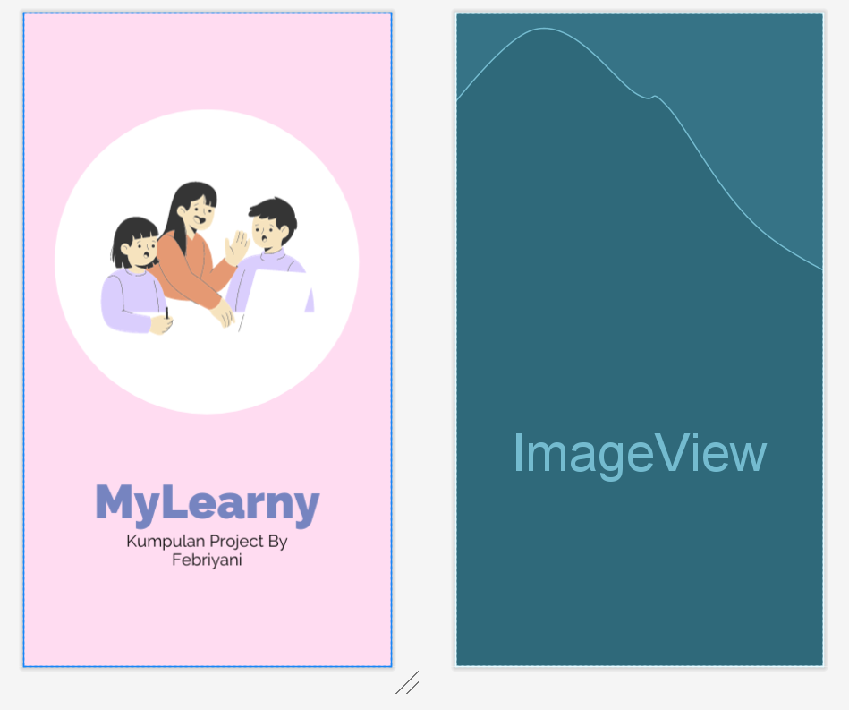
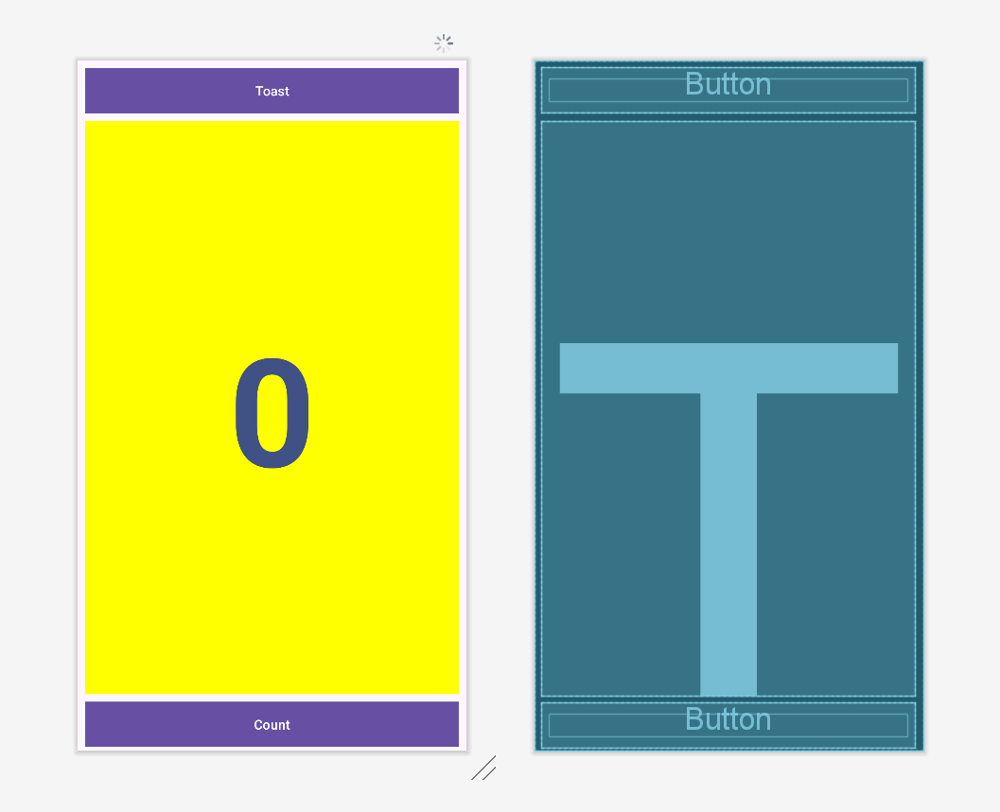
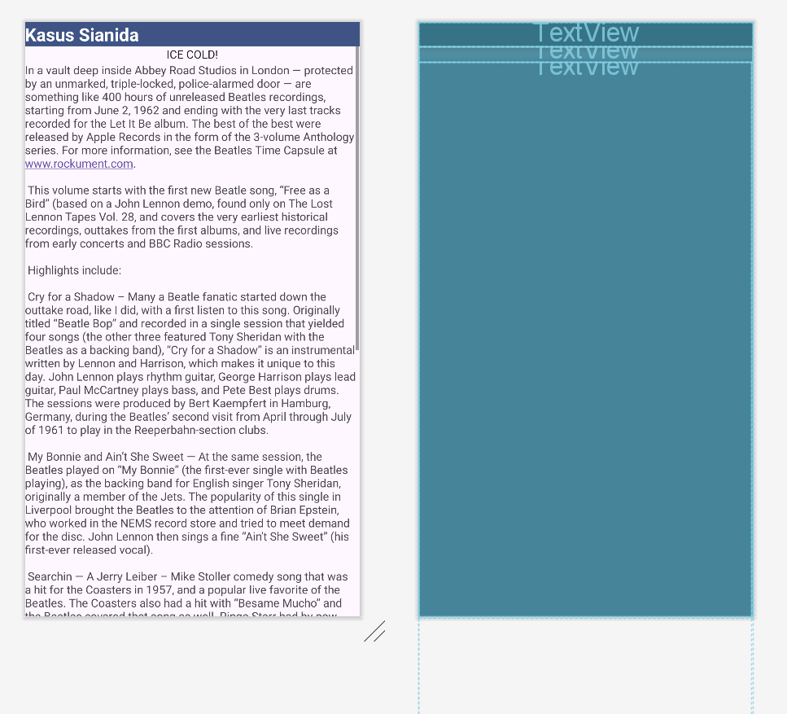
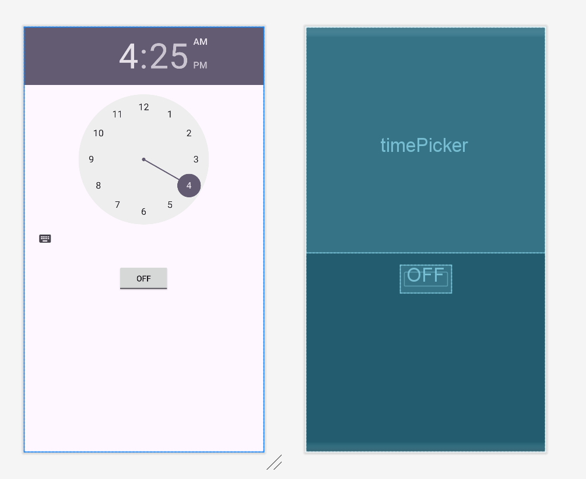
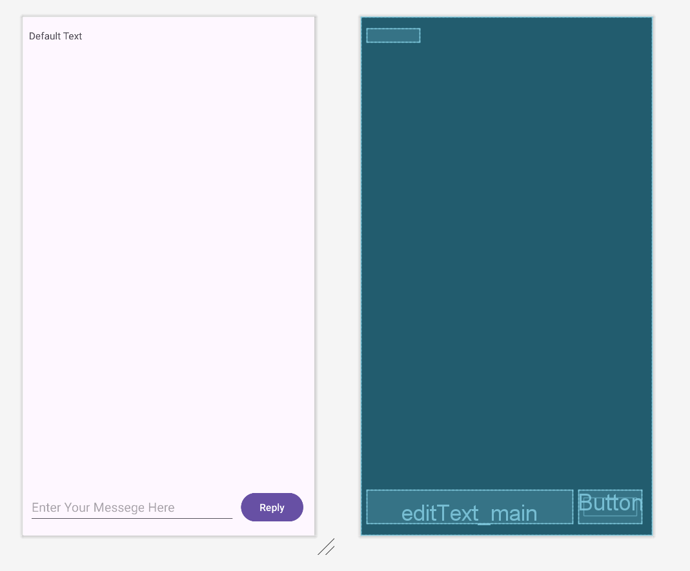
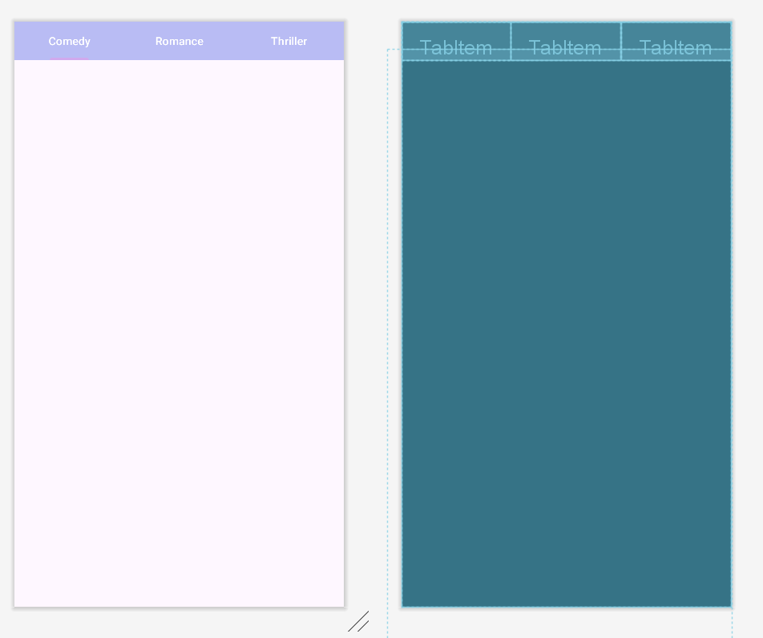

project
# Project UAS Android Studio

```
Nama            : Febriyani Nurhida
Kelas           : TI.22.A2
NIM             : 312210222
Mata Kuliah     : Pemrograman Mobile (UAS)
Dosen Pengampu  : Donny Maulana, S.Kom., M.M.S.I
```

# Febflix's App

Tyrell's App merupakan sebuah Aplikasi yang dibuat di Android Studio yang mencakup banyak Project, diantaranya yaitu :

1. Project Hello World
2. Project Count
3. Project News
4. Project Alarm
5. Project Fibonacci
6. Project Chat
7. Project Maps
8. Project Movie


## Spalshcreen
Fungsi utama :
menampilkan splashscreen

### XML For SplashScreen
```
<?xml version="1.0" encoding="utf-8"?>
<RelativeLayout xmlns:android="http://schemas.android.com/apk/res/android"
    android:layout_width="match_parent"
    android:layout_height="match_parent"
    android:background="@color/colorPrimary">

  <ImageView
      android:id="@+id/imageView_splash"
      android:layout_width="match_parent"
  android:layout_height="match_parent"
  android:src="@drawable/splash_screen"
  android:scaleType="centerCrop"/>

</RelativeLayout>

```


### JavaClass For SpalshScreen
```
package com.example.febflix;

import android.content.Intent;
import android.os.Bundle;
import android.os.Handler;

import androidx.appcompat.app.AppCompatActivity;

public class SplashScreenActivity extends AppCompatActivity {

    @Override
    protected void onCreate(Bundle savedInstanceState) {
        super.onCreate(savedInstanceState);
        setContentView(R.layout.activity_splash_screen);

        new Handler().postDelayed(new Runnable() {
            @Override
            public void run() {
                Intent intent = new Intent(SplashScreenActivity.this,MainMenu.class);
                startActivity(intent);
                finish();
            }
        }, 5000);
    }
}

```
## Main Activity
Fungsi utama :
untuk menampilkan kumpulan project dimana gambar/ icon berfungsi saat di klik menggunakan metode ```OnClick``` dan langsung mengarah ke project yang dituju misal gambar/icon movie maka saat di klik akan mengarah atau menjalankan activity movie.

### XML File For Main Activity
```
<?xml version="1.0" encoding="utf-8"?>
<RelativeLayout xmlns:android="http://schemas.android.com/apk/res/android"
    xmlns:app="http://schemas.android.com/apk/res-auto"
    xmlns:tools="http://schemas.android.com/tools"
    android:layout_width="match_parent"
    android:layout_height="match_parent"
    tools:context=".MainMenu">

    <RelativeLayout
        android:layout_width="match_parent"
        android:layout_height="1000dp"
        android:background="#FFDCF1">

        <TextView
            android:id="@+id/textView"
            android:layout_width="match_parent"
            android:layout_height="56dp"
            android:background="#ABCBFA"
            android:fontFamily="serif"
            android:text="Home Page"
            android:textAlignment="center"
            android:textColor="@color/white"
            android:textSize="34sp"
            android:textStyle="bold" />
    </RelativeLayout>

    <LinearLayout
        android:layout_width="match_parent"
        android:layout_height="match_parent"
        android:layout_marginLeft="16dp"
        android:layout_marginTop="100dp"
        android:layout_marginRight="16dp"
        android:orientation="vertical">

        <LinearLayout
            android:layout_width="match_parent"
            android:layout_height="150dp"
            android:layout_margin="5dp"
            android:orientation="horizontal">

            <androidx.cardview.widget.CardView
                android:id="@+id/cdMenu1"
                android:layout_width="match_parent"
                android:layout_height="match_parent"
                android:layout_margin="10dp"
                android:layout_weight="1"
                app:cardCornerRadius="20dp"
                app:cardElevation="7dp" >

                <LinearLayout
                    android:layout_width="match_parent"
                    android:layout_height="match_parent"
                    android:orientation="vertical"
                    android:background="#ABCBFA">

                    <ImageView
                        android:id="@+id/imageView0"
                        android:layout_width="match_parent"
                        android:layout_height="wrap_content"
                        android:layout_margin="1dp"
                        android:layout_weight="1"
                        android:onClick="launchHalloProject"
                        app:srcCompat="@drawable/img_2"  />

                    <TextView
                        android:id="@+id/textView0"
                        android:layout_width="match_parent"
                        android:layout_height="wrap_content"
                        android:fontFamily="serif"
                        android:text="Hello"
                        android:textAlignment="center"
                        android:textSize="18dp"
                        android:textStyle="bold" />
                </LinearLayout>
            </androidx.cardview.widget.CardView>

            <androidx.cardview.widget.CardView
                android:id="@+id/cdMenu2"
                android:layout_width="match_parent"
                android:layout_height="match_parent"
                android:layout_margin="10dp"
                android:layout_weight="1"
                app:cardCornerRadius="20dp"
                app:cardElevation="7dp" >

                <LinearLayout
                    android:layout_width="match_parent"
                    android:layout_height="match_parent"
                    android:orientation="vertical"
                    android:background="#ABCBFA">

                    <ImageView
                        android:id="@+id/imageView1"
                        android:layout_width="match_parent"
                        android:layout_height="wrap_content"
                        android:layout_margin="1dp"
                        android:layout_weight="1"
                        android:onClick="launchCountProject"
                        app:srcCompat="@drawable/counting" />

                    <TextView
                        android:id="@+id/textView1"
                        android:layout_width="match_parent"
                        android:layout_height="wrap_content"
                        android:fontFamily="serif"
                        android:text="Count"
                        android:textAlignment="center"
                        android:textSize="18dp"
                        android:textStyle="bold" />
                </LinearLayout>
            </androidx.cardview.widget.CardView>

            <androidx.cardview.widget.CardView
                android:id="@+id/cdMenu3"
                android:layout_width="match_parent"
                android:layout_height="match_parent"
                android:layout_margin="10dp"
                android:layout_weight="1"
                app:cardCornerRadius="20dp"
                app:cardElevation="7dp" >

                <LinearLayout
                    android:layout_width="match_parent"
                    android:layout_height="match_parent"
                    android:orientation="vertical"
                    android:background="#ABCBFA">

                    <ImageView
                        android:id="@+id/imageView2"
                        android:layout_width="match_parent"
                        android:layout_height="wrap_content"
                        android:layout_margin="1dp"
                        android:layout_weight="1"
                        android:onClick="launchSianidaProject"
                        app:srcCompat="@drawable/img_3"/>

                    <TextView
                        android:id="@+id/textView2"
                        android:layout_width="match_parent"
                        android:layout_height="wrap_content"
                        android:fontFamily="serif"
                        android:text="News"
                        android:textAlignment="center"
                        android:textSize="18dp"
                        android:textStyle="bold" />

                </LinearLayout>
            </androidx.cardview.widget.CardView>

        </LinearLayout>

        <LinearLayout
            android:layout_width="match_parent"
            android:layout_height="150dp"
            android:layout_margin="5dp"
            android:orientation="horizontal">


            <androidx.cardview.widget.CardView
                android:id="@+id/cdMenu4"
                android:layout_width="match_parent"
                android:layout_height="match_parent"
                android:layout_margin="10dp"
                android:layout_weight="1"
                app:cardCornerRadius="20dp"
                app:cardElevation="7dp">

                <LinearLayout
                    android:layout_width="match_parent"
                    android:layout_height="match_parent"
                    android:orientation="vertical"
                    android:background="#ABCBFA">

                    <ImageView
                        android:id="@+id/imageView3"
                        android:layout_width="match_parent"
                        android:layout_height="wrap_content"
                        android:layout_margin="1dp"
                        android:layout_weight="1"
                        android:onClick="launchAlarmProject"
                        app:srcCompat="@drawable/clock" />

                    <TextView
                        android:id="@+id/textView3"
                        android:layout_width="match_parent"
                        android:layout_height="wrap_content"
                        android:fontFamily="serif"
                        android:text="Alarm"
                        android:textAlignment="center"
                        android:textSize="18dp"
                        android:textStyle="bold" />
                </LinearLayout>
            </androidx.cardview.widget.CardView>

            <androidx.cardview.widget.CardView
                android:id="@+id/cdMenu5"
                android:layout_width="match_parent"
                android:layout_height="match_parent"
                android:layout_margin="10dp"
                android:layout_weight="1"
                app:cardCornerRadius="20dp"
                app:cardElevation="7dp" >

                <LinearLayout
                    android:layout_width="match_parent"
                    android:layout_height="match_parent"
                    android:orientation="vertical"
                    android:background="#ABCBFA">

                    <ImageView
                        android:id="@+id/imageView4"
                        android:layout_width="match_parent"
                        android:layout_height="wrap_content"
                        android:layout_margin="1dp"
                        android:layout_weight="1"
                        android:onClick="launchFibonacciProject"
                        app:srcCompat="@drawable/fibonacci" />

                    <TextView
                        android:id="@+id/textView4"
                        android:layout_width="match_parent"
                        android:layout_height="wrap_content"
                        android:fontFamily="serif"
                        android:text="Fibonacci"
                        android:textAlignment="center"
                        android:textSize="18dp"
                        android:textStyle="bold" />
                </LinearLayout>
            </androidx.cardview.widget.CardView>

            <androidx.cardview.widget.CardView
                android:id="@+id/cdMenu6"
                android:layout_width="match_parent"
                android:layout_height="match_parent"
                android:layout_margin="10dp"
                android:layout_weight="1"
                app:cardCornerRadius="20dp"
                app:cardElevation="7dp" >

                <LinearLayout
                    android:layout_width="match_parent"
                    android:layout_height="match_parent"
                    android:orientation="vertical"
                    android:background="#ABCBFA">

                    <ImageView
                        android:id="@+id/imageView5"
                        android:layout_width="match_parent"
                        android:layout_height="wrap_content"
                        android:layout_margin="1dp"
                        android:layout_weight="1"
                        android:onClick="launchMessegeProject"
                        app:srcCompat="@drawable/img_1" />

                    <TextView
                        android:id="@+id/textView5"
                        android:layout_width="match_parent"
                        android:layout_height="wrap_content"
                        android:fontFamily="serif"
                        android:text="Chat"
                        android:textAlignment="center"
                        android:textSize="18dp"
                        android:textStyle="bold" />
                </LinearLayout>
            </androidx.cardview.widget.CardView>
        </LinearLayout>

        <LinearLayout
            android:layout_width="249dp"
            android:layout_height="150dp"
            android:layout_margin="5dp"
            android:orientation="horizontal">

            <androidx.cardview.widget.CardView
                android:id="@+id/cdMenu7"
                android:layout_width="match_parent"
                android:layout_height="match_parent"
                android:layout_margin="10dp"
                android:layout_weight="1"
                app:cardCornerRadius="20dp"
                app:cardElevation="7dp">

                <LinearLayout
                    android:layout_width="match_parent"
                    android:layout_height="match_parent"
                    android:background="#ABCBFA"
                    android:orientation="vertical">

                    <ImageView
                        android:id="@+id/imageView7"
                        android:layout_width="match_parent"
                        android:layout_height="wrap_content"
                        android:layout_margin="1dp"
                        android:layout_weight="1"
                        android:onClick="launchMapProject"
                        app:srcCompat="@drawable/img_4" />

                    <TextView
                        android:id="@+id/textView6"
                        android:layout_width="match_parent"
                        android:layout_height="wrap_content"
                        android:fontFamily="serif"
                        android:text="Maps"
                        android:textAlignment="center"
                        android:textSize="18dp"
                        android:textStyle="bold" />
                </LinearLayout>
            </androidx.cardview.widget.CardView>

            <androidx.cardview.widget.CardView
                android:id="@+id/cdMenu8"
                android:layout_width="match_parent"
                android:layout_height="match_parent"
                android:layout_margin="10dp"
                android:layout_weight="1"
                app:cardCornerRadius="20dp"
                app:cardElevation="7dp">

                <LinearLayout
                    android:layout_width="match_parent"
                    android:layout_height="match_parent"
                    android:background="#ABCBFA"
                    android:orientation="vertical">

                    <ImageView
                        android:id="@+id/imageView8"
                        android:layout_width="match_parent"
                        android:layout_height="wrap_content"
                        android:layout_margin="1dp"
                        android:layout_weight="1"
                        android:onClick="launchMovieProject"
                        app:srcCompat="@drawable/movv" />

                    <TextView
                        android:id="@+id/textView7"
                        android:layout_width="match_parent"
                        android:layout_height="wrap_content"
                        android:fontFamily="serif"
                        android:text="Febflix"
                        android:textAlignment="center"
                        android:textSize="18dp"
                        android:textStyle="bold" />
                </LinearLayout>
            </androidx.cardview.widget.CardView>

        </LinearLayout>

    </LinearLayout>

</RelativeLayout>
```


### JavaClass For Main Activity
```
package com.example.febflix;

import android.content.Intent;
import android.os.Bundle;
import android.view.View;
import androidx.appcompat.app.AppCompatActivity;
import androidx.cardview.widget.CardView;

public class MainMenu extends AppCompatActivity {

    @Override
    protected void onCreate(Bundle savedInstanceState) {
        super.onCreate(savedInstanceState);
        setContentView(R.layout.activity_main_menu);

        // Inisialisasi CardView
        CardView cdMenu1 = findViewById(R.id.cdMenu1);
        CardView cdMenu2 = findViewById(R.id.cdMenu2);
        CardView cdMenu3 = findViewById(R.id.cdMenu3);
        CardView cdMenu4 = findViewById(R.id.cdMenu4);
        CardView cdMenu5 = findViewById(R.id.cdMenu5);
        CardView cdMenu6 = findViewById(R.id.cdMenu6);
        CardView cdMenu7 = findViewById(R.id.cdMenu7);
        CardView cdMenu8 = findViewById(R.id.cdMenu8);

        // Set OnClickListener untuk setiap CardView
        cdMenu1.setOnClickListener(new View.OnClickListener() {
            @Override
            public void onClick(View v) {
                // ... kode onClick
            }
        });

        cdMenu2.setOnClickListener(new View.OnClickListener() {
            @Override
            public void onClick(View v) {
                // ... kode onClick
                launchCountProject(v);
            }
        });

        cdMenu3.setOnClickListener(new View.OnClickListener() {
            @Override
            public void onClick(View v) {
                // ... kode onClick
                launchSianidaProject(v);
            }
        });

        cdMenu4.setOnClickListener(new View.OnClickListener() {
            @Override
            public void onClick(View v) {
                // ... kode onClick
                launchAlarmProject(v);
            }
        });

        cdMenu5.setOnClickListener(new View.OnClickListener() {
            @Override
            public void onClick(View v) {
                // ... kode onClick
                launchFibonacciProject(v);
            }
        });

        cdMenu6.setOnClickListener(new View.OnClickListener() {
            @Override
            public void onClick(View v) {
                // ... kode onClick
                launchMessegeProject(v);
            }
        });

        cdMenu7.setOnClickListener(new View.OnClickListener() {
            @Override
            public void onClick(View v) {
                // ... kode onClick
                launchMapProject(v);
            }
        });

        cdMenu8.setOnClickListener(new View.OnClickListener() {
            @Override
            public void onClick(View v) {
                // ... kode onClick
                launchMovieProject(v);
            }
        });
    }

    // Metode untuk menjalankan aktivitas Count
    public void launchCountProject(View v) {
        Intent intent = new Intent(this, Count.class);
        startActivity(intent);
    }

    // Metode untuk menjalankan aktivitas Sianida
    public void launchSianidaProject(View v) {
        Intent intent = new Intent(this, Sianida.class);
        startActivity(intent);
    }

    // Metode untuk menjalankan aktivitas Alarm
    public void launchAlarmProject(View v) {
        Intent intent = new Intent(this, Alarm.class);
        startActivity(intent);
    }

    // Metode untuk menjalankan aktivitas Fibonacci
    public void launchFibonacciProject(View v) {
        Intent intent = new Intent(this, Fibonacci.class);
        startActivity(intent);
    }

    // Metode untuk menjalankan aktivitas Messege
    public void launchMessegeProject(View v) {
        Intent intent = new Intent(this, Messege1.class);
        startActivity(intent);
    }

    // Metode untuk menjalankan aktivitas Map
    public void launchMapProject(View v) {
        Intent intent = new Intent(this, Maps.class);
        startActivity(intent);
    }

    // Metode untuk menjalankan aktivitas Movie
    public void launchMovieProject(View v) {
        Intent intent = new Intent(this, ViewPager.class);
        startActivity(intent);
    }

}

```

## Manifest
```
<?xml version="1.0" encoding="utf-8"?>
<manifest xmlns:android="http://schemas.android.com/apk/res/android"
    xmlns:dist="http://schemas.android.com/apk/distribution"
    package="com.example.febflix" >

    <dist:module dist:instant="true" />

    <uses-permission android:name="android.permission.INTERNET" />
    <uses-permission android:name="android.permission.VIBRATE" />
    <uses-permission android:name="com.android.alarm.permission.SET_ALARM" />
    <uses-permission android:name="android.permission.ACCESS_FINE_LOCATION" />
    <uses-permission android:name="android.permission.ACCESS_COARSE_LOCATION" />

    <application
        android:allowBackup="true"
        android:dataExtractionRules="@xml/data_extraction_rules"
        android:fullBackupContent="@xml/backup_rules"
        android:icon="@mipmap/ic_launcher"
        android:label="@string/app_name"
        android:roundIcon="@mipmap/ic_launcher_round"
        android:supportsRtl="true"
        android:theme="@style/Theme.Febflix" >

        <activity
            android:name=".ViewPager"
            android:exported="false" />
        <activity
            android:name=".SplashScreenActivity"
            android:exported="true" >
            <intent-filter>
                <action android:name="android.intent.action.MAIN" />

                <category android:name="android.intent.category.LAUNCHER" />
            </intent-filter>
        </activity>
        <activity
            android:name=".MainMenu"
            android:exported="false" />
        <activity
            android:name=".PlayerMinions"
            android:exported="false"/>
        <activity
            android:name=".PlayerSpongebob"
            android:exported="false"/>
        <activity
            android:name=".PlayerBaymax"
            android:exported="false"/>
        <activity
            android:name=".PlayerOurBeloved"
            android:exported="false"/>
        <activity
            android:name=".PlayerTw"
            android:exported="false"/>
        <activity
            android:name=".PlayerStartup"
            android:exported="false"/>
        <activity
            android:name=".PlayerTheLies"
            android:exported="false"/>
        <activity
            android:name=".PlayerGirlFrom"
            android:exported="false"/>
        <activity
            android:name=".PlayerAllOff"
            android:exported="false"/>
        <activity
            android:name=".Hallo"
            android:exported="false" />
        <activity
            android:name=".Count"
            android:exported="false" />
        <activity
            android:name=".Sianida"
            android:exported="false" />
        <activity
            android:name=".Maps"
            android:exported="false" />
        <activity
            android:name=".Alarm"
            android:exported="false" />
        <activity
            android:name=".Messege1"
            android:label="First Activity"
            android:parentActivityName=".MainMenu" >
            <meta-data
                android:name="android.support.PARENT_ACTIVITY"
                android:value=".MainMenu" />
        </activity>
        <activity
            android:name=".Messege2"
            android:label="Second Activity"
            android:parentActivityName=".Messege1" >
            <meta-data
                android:name="android.support.PARENT_ACTIVITY"
                android:value=".Messege1" />
        </activity>
        <activity
            android:name=".Fibonacci"
            android:exported="false" />
    </application>

</manifest>
```
## Project Hello

Metode Utama:

- `onCreate`: Menginisialisasi dan menetapkan tata letak (layout) dengan menggunakan `setContentView`.

Fungsi Utama:
Menampilkan Layout:

- Kode ini bertujuan untuk menampilkan layout dengan nama `activity_hello` ke pengguna.

Catatan:

- Kode ini adalah contoh sederhana dari sebuah aktivitas di Android yang menggunakan layout untuk menampilkan antarmuka pengguna.
- Aktivitas ini tidak memiliki interaksi pengguna tambahan, karena hanya menampilkan layout yang telah ditentukan (`activity_hello`).
- Sangat penting untuk memastikan bahwa file layout yang disebutkan dalam `setContentView` (`activity_hello`) tersedia dan telah dikonfigurasi sesuai kebutuhan aplikasi.

### xml file
```
<?xml version="1.0" encoding="utf-8"?>
<androidx.constraintlayout.widget.ConstraintLayout xmlns:android="http://schemas.android.com/apk/res/android"
    xmlns:app="http://schemas.android.com/apk/res-auto"
    xmlns:tools="http://schemas.android.com/tools"
    android:layout_width="match_parent"
    android:layout_height="match_parent"
    tools:context=".Hallo">

    <TextView
        android:layout_width="0dp"
        android:layout_height="0dp"
        android:layout_marginStart="8dp"
        android:layout_marginTop="8dp"
        android:layout_marginEnd="8dp"
        android:layout_marginBottom="8dp"
        android:gravity="center"
        android:text="Halo Apa Kabar?"
        android:background="@color/white"
        android:textSize="16dp"
        android:textColor="@color/blue"
        app:layout_constraintBottom_toBottomOf="parent"
        app:layout_constraintEnd_toEndOf="parent"
        app:layout_constraintStart_toStartOf="parent"
        app:layout_constraintTop_toTopOf="parent" />
</androidx.constraintlayout.widget.ConstraintLayout>
```

### Java Class
```
package com.example.febflix;

import android.os.Bundle;

import androidx.appcompat.app.AppCompatActivity;

public class Hallo extends AppCompatActivity {

    @Override
    protected void onCreate(Bundle savedInstanceState) {
        super.onCreate(savedInstanceState);
        setContentView(R.layout.activity_hallo);
    }

}
```

## Project Count

Metode Utama:

- `onCreate`: Menginisialisasi tata letak (layout) dan komponen-komponen yang diperlukan.
- `countUp`: Menaikkan nilai hitungan dan menampilkan pada `TextView`.
- `showToast`: Menampilkan pesan Toast saat tombol diklik.

Fungsi Utama:

- Inisialisasi:
  - `onCreate` digunakan untuk menginisialisasi aktivitas dan menetapkan layout (`activity_count`) serta mendapatkan referensi ke `TextView` (`show_count`).
  - Penjumlahan dan Tampilan:
  - `countUp` digunakan untuk menambah nilai hitungan (`currentCount`) dan menampilkan pada `TextView` (`show_count`).
  - Pesan Toast:
  - `showToast` menampilkan pesan Toast dengan pesan yang diambil dari sumber daya string (`R.string.toast_message`).

Catatan:

- `currentCount` digunakan untuk menyimpan nilai hitungan saat ini.
- Fungsi `countUp` digunakan untuk meningkatkan nilai hitungan dan memperbarui tampilan pada `TextView`.
- Fungsi `showToast` digunakan untuk menampilkan pesan Toast yang berasal dari sumber daya string.

### xml file
```
<?xml version="1.0" encoding="utf-8"?>
<androidx.constraintlayout.widget.ConstraintLayout xmlns:android="http://schemas.android.com/apk/res/android"
    android:layout_width="match_parent"
    android:layout_height="match_parent"
    xmlns:app="http://schemas.android.com/apk/res-auto"
    xmlns:tools="http://schemas.android.com/tools"
    tools:context=".Count">

  <Button
      android:id="@+id/button_toast"
      android:layout_width="match_parent"
      android:layout_height="wrap_content"
      android:layout_marginEnd="8dp"
      android:layout_marginStart="8dp"
      android:layout_marginTop="8dp"
      android:background="@color/colorPrimary"
      android:onClick="showToast"
      android:text="Toast"
      android:textColor="@android:color/white"
      app:layout_constraintEnd_toEndOf="parent"
      app:layout_constraintStart_toStartOf="parent"
      app:layout_constraintHorizontal_bias="0.0"
      app:layout_constraintTop_toTopOf="parent"
      tools:ignore="OnClick" />

  <Button
      android:id="@+id/button_count"
      android:layout_width="match_parent"
      android:layout_height="wrap_content"
      android:layout_marginStart="8dp"
      android:layout_marginEnd="8dp"
      android:layout_marginBottom="4dp"
      android:background="@color/colorPrimary"
      android:onClick="countUp"
      android:text="Count"
      android:textColor="@android:color/white"
      app:layout_constraintBottom_toBottomOf="parent"
      app:layout_constraintEnd_toEndOf="parent"
      app:layout_constraintHorizontal_bias="0.0"
      app:layout_constraintStart_toStartOf="parent" />

  <TextView
      android:id="@+id/show_count"
      android:layout_width="0dp"
      android:layout_height="0dp"
      android:layout_marginStart="8dp"
      android:layout_marginTop="8dp"
      android:layout_marginEnd="8dp"
      android:layout_marginBottom="8dp"
      android:background="#FFFF00"
      android:gravity="center_vertical"
      android:text="0"
      android:textAlignment="center"
      android:textColor="@color/colorPrimary"
      android:textSize="160sp"
      android:textStyle="bold"
      app:layout_constraintBottom_toTopOf="@+id/button_count"
      app:layout_constraintEnd_toEndOf="parent"
      app:layout_constraintHorizontal_bias="0.0"
      app:layout_constraintStart_toStartOf="parent"
      app:layout_constraintTop_toBottomOf="@+id/button_toast"
      app:layout_constraintVertical_bias="0.0"
      tools:ignore="RtlCompat" />
</androidx.constraintlayout.widget.ConstraintLayout>
```


### Java Class
```
package com.example.febflix;

import androidx.appcompat.app.AppCompatActivity;

import android.annotation.SuppressLint;
import android.os.Bundle;
import android.view.View;
import android.widget.TextView;
import android.widget.Toast;

public class Count extends AppCompatActivity {

    private TextView mShowCount;
    private int currentCount = 0;

    @SuppressLint("MissingInflatedId")
    @Override
    protected void onCreate(Bundle savedInstanceState) {
        super.onCreate(savedInstanceState);
        setContentView(R.layout.activity_count);

        // Inisialisasi TextView
        mShowCount = findViewById(R.id.show_count);
    }

    public void countUp(View view) {
        // Menambahkan nilai perhitungan dan menampilkan di TextView
        currentCount++;
        mShowCount.setText(String.valueOf(currentCount));
    }

    public void showToast(View view) {
        Toast toast = Toast.makeText(this, R.string.toast_message, Toast.LENGTH_SHORT);
        toast.show();
    }
}
```
## Project News

- Metode Utama:
- `onCreate`: Menginisialisasi aktivitas dan menetapkan tata letak (layout) yang diberikan oleh `activity_icecold`.

Fungsi Utama:

- Inisialisasi:
- `onCreate` digunakan untuk menginisialisasi aktivitas dan menetapkan layout (`activity_icecold`) yang berisi tampilan berita.

Tampilan Berita:\*\*

- Aktivitas ini bertujuan untuk menampilkan tampilan berita yang diatur dalam layout `activity_icecold`.

Pembaruan dan Rekomendasi:

- Menambahkan komponen-komponen UI atau fungsionalitas tambahan sesuai kebutuhan aplikasi.
- Menggunakan komponen Android seperti `TextView`, `ImageView`, atau `WebView` untuk menampilkan konten berita yang lebih dinamis.


### xml file
```
<?xml version="1.0" encoding="utf-8"?>
<RelativeLayout xmlns:android="http://schemas.android.com/apk/res/android"
    xmlns:tools="http://schemas.android.com/tools"
    android:layout_width="match_parent"
    android:layout_height="match_parent"
    tools:context=".Sianida">

    <TextView
        android:id="@+id/article_heading"
        android:layout_width="match_parent"
        android:layout_height="wrap_content"
        android:background="@color/colorPrimery"
        android:padding="@dimen/padding_regular"
        android:text="@string/article_title"
        android:textAppearance="@android:style/TextAppearance.DeviceDefault.Large"
        android:textColor="@android:color/white"
        android:textStyle="bold"/>

    <ScrollView
        android:layout_width="wrap_content"
        android:layout_height="wrap_content"
        android:layout_below="@id/article_heading">

        <LinearLayout
            android:layout_width="match_parent"
            android:layout_height="wrap_content"
            android:orientation="vertical">

            <TextView
                android:id="@+id/article_subheading"
                android:textAlignment="center"
                android:layout_width="match_parent"
                android:layout_height="wrap_content"
                android:padding="@dimen/padding_regular"
                android:text="@string/article_subtitle"
                android:textAppearance="@android:style/TextAppearance.DeviceDefault"/>

            <TextView
                android:id="@+id/article"
                android:layout_width="wrap_content"
                android:layout_height="wrap_content"
                android:autoLink="web"
                android:lineSpacingExtra="@dimen/line_spacing"
                android:padding="@dimen/padding_regular"
                android:text="@string/article_text" />
        </LinearLayout>
    </ScrollView>

</RelativeLayout>
```

### Java Class
```
package com.example.febflix;

import android.os.Bundle;

import androidx.appcompat.app.AppCompatActivity;

public class Sianida  extends AppCompatActivity {
    @Override
    protected void onCreate(Bundle savedInstanceState){
        super.onCreate(savedInstanceState);
        setContentView(R.layout.activity_sianida);
    }
}
```

## Project Alarm

- Metode Utama:
  - `onCreate`: Menginisialisasi `TimePicker` dan `AlarmManager`.
  - `OnToggleClicked`: Mengelola fungsi alarm saat tombol toggle diubah.
- Fungsi Utama:
  - Setting Alarm:
    - Membuat objek `Calendar` untuk mendapatkan waktu saat ini dalam jam dan menit.
    - Menetapkan jam dan menit pada objek `Calendar` berdasarkan `TimePicker`.
    - Membuat objek `Intent` untuk memanggil `AlarmReceiver` saat alarm berbunyi.
    - Membuat objek `PendingIntent` untuk memanggil siaran tertunda saat alarm berbunyi.
    - Mengatur waktu alarm menggunakan `AlarmManager.setRepeating`.
    - Jika waktu saat ini lebih besar dari waktu alarm yang diatur, penyesuaian waktu dilakukan untuk alarm keesokan harinya.
    - Alarm berbunyi terus-menerus sampai tombol toggle dimatikan.
  - Mematikan Alarm:
    - Membatalkan alarm menggunakan `AlarmManager.cancel` saat tombol toggle dimatikan.

Pesan Log:

- Menampilkan pesan toast "ALARM ON" saat tombol toggle dihidupkan.
- Menampilkan pesan toast "ALARM OFF" saat tombol toggle dimatikan.

### xml file
```
<?xml version="1.0" encoding="utf-8"?>
<LinearLayout xmlns:android="http://schemas.android.com/apk/res/android"
    xmlns:app="http://schemas.android.com/apk/res-auto"
    xmlns:tools="http://schemas.android.com/tools"
    android:layout_width="match_parent"
    android:layout_height="match_parent"
    android:orientation="vertical"
    tools:context=".Alarm">

    <TimePicker
        android:id="@+id/timePicker"
        android:layout_width="wrap_content"
        android:layout_height="wrap_content"
        android:layout_gravity="center" />

    <ToggleButton
        android:id="@+id/toggleButton"
        android:layout_width="wrap_content"
        android:layout_height="wrap_content"
        android:layout_gravity="center"
        android:layout_margin="20dp"
        android:checked="false"
        android:onClick="OnToggleClicked" />

</LinearLayout>
```

### Java Class
```
package com.example.febflix;

import androidx.appcompat.app.AppCompatActivity;

import android.app.AlarmManager;
import android.app.PendingIntent;
import android.content.Intent;
import android.os.Bundle;
import android.view.View;
import android.widget.TimePicker;
import android.widget.Toast;
import android.widget.ToggleButton;

import java.util.Calendar;

public class Alarm extends AppCompatActivity {

    TimePicker alarmTimePicker;
    PendingIntent pendingIntent;
    AlarmManager alarmManager;

    @Override
    protected void onCreate(Bundle savedInstanceState) {
        super.onCreate(savedInstanceState);
        setContentView(R.layout.activity_alarm);
        alarmTimePicker = (TimePicker) findViewById(R.id.timePicker);
        alarmManager = (AlarmManager) getSystemService(ALARM_SERVICE);
    }

    // OnToggleClicked() method is implemented the time functionality
    public void OnToggleClicked(View view) {
        long time;
        if (((ToggleButton) view).isChecked()) {
            Toast.makeText(Alarm.this, "ALARM ON", Toast.LENGTH_SHORT).show();
            Calendar calendar = Calendar.getInstance();

            // calendar is called to get current time in hour and minute
            calendar.set(Calendar.HOUR_OF_DAY, alarmTimePicker.getCurrentHour());
            calendar.set(Calendar.MINUTE, alarmTimePicker.getCurrentMinute());

            // using intent i have class AlarmReceiver class which inherits
            // BroadcastReceiver
            Intent intent = new Intent(this, AlarmReceiver.class);

            // we call broadcast using pendingIntent
            pendingIntent = PendingIntent.getBroadcast(this, 0, intent, PendingIntent.FLAG_IMMUTABLE);


            time = (calendar.getTimeInMillis() - (calendar.getTimeInMillis() % 60000));
            if (System.currentTimeMillis() > time) {
                // setting time as AM and PM
                if (Calendar.AM_PM == 0)
                    time = time + (1000 * 60 * 60 * 12);
                else
                    time = time + (1000 * 60 * 60 * 24);
            }
            // Alarm rings continuously until toggle button is turned off
            alarmManager.setRepeating(AlarmManager.RTC_WAKEUP, time, 10000, pendingIntent);
            // alarmManager.set(AlarmManager.RTC_WAKEUP, System.currentTimeMillis() + (time * 1000), pendingIntent);
        } else {
            alarmManager.cancel(pendingIntent);
            Toast.makeText(Alarm.this, "ALARM OFF", Toast.LENGTH_SHORT).show();
        }
    }
}
```

#### Java Class For Alarm Reciever
```
package com.example.febflix;

import android.content.BroadcastReceiver;
import android.content.Context;
import android.content.Intent;
import android.media.Ringtone;
import android.media.RingtoneManager;
import android.net.Uri;
import android.os.Build;
import android.os.Vibrator;
import android.widget.Toast;

import androidx.annotation.RequiresApi;

public class AlarmReceiver extends BroadcastReceiver {
    @RequiresApi(api = Build.VERSION_CODES.Q)
    @Override
    // implement onReceive() method
    public void onReceive(Context context, Intent intent) {

        // we will use vibrator first
        Vibrator vibrator = (Vibrator) context.getSystemService(Context.VIBRATOR_SERVICE);
        vibrator.vibrate(4000);

        Toast.makeText(context, "Alarm! Wake up! Wake up!", Toast.LENGTH_LONG).show();
        Uri alarmUri = RingtoneManager.getDefaultUri(RingtoneManager.TYPE_ALARM);
        if (alarmUri == null) {
            alarmUri = RingtoneManager.getDefaultUri(RingtoneManager.TYPE_NOTIFICATION);
        }

        // setting default ringtone
        Ringtone ringtone = RingtoneManager.getRingtone(context, alarmUri);

        // play ringtone
        ringtone.play();
    }
}
```

## Project Fibonacci

- Metode Utama:
  - `onCreate`: Menginisialisasi aktivitas dan menetapkan tata letak (layout) yang diberikan oleh `activity_toast`.
  - `updateCountDisplay`: Memperbarui tampilan pengguna dengan nilai terkini dari bilangan Fibonacci dan menyesuaikan warna teks berdasarkan aturan tertentu.
  - `showToast`: Menampilkan pesan Toast yang memberi tahu pengguna bahwa mereka berurusan dengan bilangan Fibonacci.
  - `countUp`: Menambahkan nilai bilangan Fibonacci dan memperbarui tampilan pengguna sesuai.
  - `back1`: Mengembalikan pengaturan ke awal dengan mengatur ulang nilai-nilai untuk menghitung bilangan Fibonacci.

Fungsi Utama:

- Inisialisasi:
  - `onCreate` digunakan untuk menginisialisasi aktivitas, menetapkan layout (`activity_toast`), dan mengakses elemen antarmuka pengguna seperti `TextView` dan `EditText`.
- Perhitungan Bilangan Fibonacci:
  - `countUp` digunakan untuk menghitung dan menampilkan bilangan Fibonacci selanjutnya berdasarkan input pengguna.
- Pengaturan Ulang:
  - `back1` memungkinkan pengguna mengatur ulang hitungan bilangan Fibonacci ke kondisi awal.

Antarmuka Pengguna:

- TextView: Menampilkan nilai bilangan Fibonacci dan berubah warna sesuai aturan tertentu.
- EditText: Memungkinkan pengguna memasukkan nilai maksimum untuk perhitungan bilangan Fibonacci.

Pesan Toast:

- Pesan Toast diperlihatkan saat pengguna menekan tombol untuk menyoroti penggunaan bilangan Fibonacci dalam aktivitas ini.

### xml file
```
<?xml version="1.0" encoding="utf-8"?>
<androidx.constraintlayout.widget.ConstraintLayout
    xmlns:android="http://schemas.android.com/apk/res/android"
    xmlns:app="http://schemas.android.com/apk/res-auto"
    xmlns:tools="http://schemas.android.com/tools"
    android:layout_width="match_parent"
    android:layout_height="match_parent"
    tools:ignore="ExtraText"
    tools:context="com.example.febflix.Fibonacci">


    <Button
        android:id="@+id/button_limit"
        android:layout_width="409dp"
        android:layout_height="84dp"
        android:layout_marginStart="8dp"
        android:layout_marginTop="16dp"
        android:layout_marginEnd="8dp"
        android:background="@color/colorPrimary"
        android:onClick="setLimit"
        android:text="Masukkan Angka Limit"
        android:textColor="@android:color/white"
        app:layout_constraintEnd_toEndOf="parent"
        app:layout_constraintHorizontal_bias="0.507"
        app:layout_constraintStart_toStartOf="parent"
        app:layout_constraintTop_toTopOf="parent"
        tools:ignore="UsingOnClickInXml,VisualLintButtonSize" />

    <Button
        android:id="@+id/button_count"
        android:layout_width="190dp"
        android:layout_height="80dp"
        android:layout_marginStart="8dp"
        android:layout_marginEnd="8dp"
        android:layout_marginBottom="8dp"
        android:background="@color/colorPrimary"
        android:onClick="countUp"
        android:text="Count"
        android:textColor="@android:color/white"
        app:layout_constraintBottom_toBottomOf="parent"
        app:layout_constraintEnd_toEndOf="parent"
        app:layout_constraintHorizontal_bias="0.0"
        app:layout_constraintStart_toStartOf="parent"
        tools:ignore="UsingOnClickInXml,VisualLintButtonSize" />

    <Button
        android:id="@+id/button_restart"
        android:layout_width="190dp"
        android:layout_height="80dp"
        android:layout_marginStart="8dp"
        android:layout_marginEnd="8dp"
        android:layout_marginBottom="8dp"
        android:background="@color/colorPrimary"
        android:onClick="back1"
        android:text="Restart"
        android:textColor="@android:color/white"
        app:layout_constraintBottom_toBottomOf="parent"
        app:layout_constraintEnd_toEndOf="parent"
        app:layout_constraintHorizontal_bias="1.0"
        app:layout_constraintStart_toStartOf="parent"
        tools:ignore="UsingOnClickInXml" />

    <TextView
        android:id="@+id/show_count"
        android:layout_width="417dp"
        android:layout_height="649dp"
        android:layout_marginStart="8dp"
        android:layout_marginTop="8dp"
        android:layout_marginEnd="8dp"
        android:layout_marginBottom="8dp"
        android:background="#FFFF00"
        android:gravity="center_vertical"
        android:text="0"
        android:textAlignment="center"
        android:textColor="@color/colorPrimary"
        android:textSize="160sp"
        android:textStyle="bold"
        app:layout_constraintBottom_toTopOf="@id/button_count"
        app:layout_constraintEnd_toEndOf="parent"
        app:layout_constraintStart_toStartOf="parent"
        app:layout_constraintTop_toBottomOf="@id/button_limit"
        app:layout_constraintVertical_bias="0.0"
        tools:ignore="RtlCompat" />

</androidx.constraintlayout.widget.ConstraintLayout>
```

### Java Class
```
package com.example.febflix;

import android.app.AlertDialog;
import android.content.DialogInterface;
import android.graphics.Color;
import android.os.Bundle;
import android.view.View;
import android.widget.EditText;
import android.widget.TextView;
import androidx.appcompat.app.AppCompatActivity;


public class Fibonacci extends AppCompatActivity {
    private TextView show_count;
    private int count = 1;
    private long fibNMinus1 = 1;
    private long fibNMinus2 = 1;
    private int limit = -1; // Inisialisasi limit dengan nilai default

    @Override
    protected void onCreate(Bundle savedInstanceState) {
        super.onCreate(savedInstanceState);
        setContentView(R.layout.activity_fibonacci);

        show_count = findViewById(R.id.show_count);
    }

    public void countUp(View view) {
        if (count == 1) {
            show_count.setText("0");
        }

        else {
            if (limit != -1 && count > limit) {
                // Jika count melebihi limit, atur ulang perhitungan
                count = 1;
                fibNMinus1 = 1;
                fibNMinus2 = 0;
                show_count.setText(getString(R.string.count_initial_value));
            }
            else {
                long fibCurrent = fibNMinus1 + fibNMinus2;
                fibNMinus2 = fibNMinus1;
                fibNMinus1 = fibCurrent;

                //Mengatur warna teks berdasarkan angka Fibonacci
                int colorResId = R.color.orange; // Warna Default
                switch (count % 11) {
                    case 1:
                        colorResId = R.color.orange; // Warna Orange
                        break;
                    case 2:
                        colorResId = R.color.hijaumuda; // Warna Hijau Muda
                        break;
                    case 3:
                        colorResId = R.color.purple; // Warna Ungu
                        break;
                    case 4:
                        colorResId = R.color.salem; // Warna Salem
                        break;
                    case 5:
                        colorResId = R.color.birumuda; // Warna Biru Muda
                        break;
                    case 6 :
                        colorResId = R.color.purple; // Warna Kuning
                        break;
                    case 7:
                        colorResId = R.color.hijau; // Warna Hijau
                        break;
                    case 8:
                        colorResId = R.color.cream; // Warna Cream
                        break;
                    case 9:
                        colorResId = R.color.pink; // Warna Pink
                        break;
                    case 10:
                        colorResId = R.color.biru; // Warna Biru
                        break;
                    case 11:
                        colorResId = R.color.colorAccent; // Warna Pink Tua
                        break;
                }
                show_count.setTextColor(getResources().getColor(colorResId));
                show_count.setText(String.valueOf(fibCurrent));
                show_count.setBackgroundColor(Color.YELLOW);
            }
        }

        count++;
    }

    public void back1(View view) {
        count = 1;
        fibNMinus1 = 1;
        fibNMinus2 = 0;
        show_count.setText("0"); // Mengatur teks pada TextView menjadi "0"
        show_count.setTextColor(getResources().getColor(R.color.colorPrimary)); // Mengatur warna teks kembali ke warna default
        show_count.setBackgroundColor(Color.YELLOW); // Menghapus latar belakang yang mungkin telah diatur sebelumnya
    }


    public void setLimit(View view) {
        // Create and display a dialog to set the limit
        AlertDialog.Builder builder = new AlertDialog.Builder(this);
        builder.setTitle("Set Limit");

        final EditText input = new EditText(this);
        input.setInputType(android.text.InputType.TYPE_CLASS_NUMBER);
        builder.setView(input);

        builder.setPositiveButton("OK", new DialogInterface.OnClickListener() {
            @Override
            public void onClick(DialogInterface dialog, int which) {
                // Get the limit from the input and set it for calculations
                String limitStr = input.getText().toString();
                limit = Integer.parseInt(limitStr);
            }
        });

        builder.setNegativeButton("Cancel", new DialogInterface.OnClickListener() {
            @Override
            public void onClick(DialogInterface dialog, int which) {
                dialog.cancel();
            }
        });

        builder.show();
    }
}
```

## Project Chat

Struktur Kode:

- Variabel Kelas:

  - `LOG_TAG`: Variabel konstan yang digunakan untuk tag log.
  - `EXTRA_MESSAGE`: Variabel konstan yang berfungsi sebagai kunci untuk menyimpan pesan ekstra dalam Intent.
  - `TEXT_REQUEST`: Konstanta yang menentukan kode permintaan untuk startActivityForResult.
  - `mMessageEditText`: EditText untuk memasukkan pesan.
  - `mReplyHeadTextView`: TextView untuk menampilkan header balasan.
  - `mReplyTextView`: TextView untuk menampilkan balasan.

- Metode onCreate:
  - Menginisialisasi tampilan dan variabel kelas.
- Metode launchSecondActivity:

  - Dipanggil ketika tombol di MainActivityOne diklik.
  - Membuat Intent untuk memulai SecondActivity dengan membawa pesan dari `mMessageEditText`.
  - Memulai aktivitas kedua dengan `startActivityForResult` untuk mendapatkan hasil balasan.

- Metode onActivityResult:
  - Dipanggil ketika aktivitas kedua selesai.
  - Memeriksa apakah permintaan adalah `TEXT_REQUEST` dan hasilnya adalah `RESULT_OK`.
  - Menampilkan header balasan dan menetapkan teks balasan ke `mReplyTextView`.

  ### xml file for messege 1
```
<?xml version="1.0" encoding="utf-8"?>
<androidx.constraintlayout.widget.ConstraintLayout xmlns:android="http://schemas.android.com/apk/res/android"
    xmlns:tools="http://schemas.android.com/tools"
    android:layout_width="match_parent"
    android:layout_height="match_parent"
    xmlns:app="http://schemas.android.com/apk/res-auto"
    tools:context=".Messege1">

    <TextView
        android:id="@+id/text_header_reply"
        android:layout_width="wrap_content"
        android:layout_height="wrap_content"
        android:layout_marginStart="8dp"
        android:layout_marginLeft="8dp"
        android:layout_marginTop="16dp"
        android:text="@string/text_header_reply"
        android:textAppearance="@style/TextAppearance.AppCompat.Medium"
        android:textStyle="bold"
        android:visibility="invisible"
        app:layout_constraintStart_toStartOf="parent"
        app:layout_constraintTop_toTopOf="parent"
        />

    <TextView
        android:id="@+id/text_message_reply"
        android:layout_width="wrap_content"
        android:layout_height="wrap_content"
        android:layout_marginStart="8dp"
        android:layout_marginLeft="8dp"
        android:layout_marginTop="8dp"
        android:visibility="invisible"
        app:layout_constraintStart_toStartOf="parent"
        app:layout_constraintTop_toBottomOf="@+id/text_header_reply"
        android:text="TextView" />

    <Button
        android:id="@+id/button_main"
        android:layout_width="wrap_content"
        android:layout_height="wrap_content"
        android:layout_marginBottom="16dp"
        android:layout_marginRight="16dp"
        android:text="@string/button_main"
        android:onClick="launchSecondActivity"
        app:layout_constraintBottom_toBottomOf="parent"
        app:layout_constraintRight_toRightOf="parent" />

    <EditText
        android:id="@+id/editText_main"
        android:layout_width="0dp"
        android:layout_height="wrap_content"
        android:layout_marginBottom="16dp"
        android:layout_marginEnd="8dp"
        android:layout_marginStart="8dp"
        android:ems="10"
        android:minHeight="48dp"
        android:hint="@string/editText_main"
        android:inputType="textLongMessage"
        app:layout_constraintBottom_toBottomOf="parent"
        app:layout_constraintEnd_toStartOf="@+id/button_main"
        app:layout_constraintStart_toStartOf="parent" />
</androidx.constraintlayout.widget.ConstraintLayout>
```

### Java Class for messege 1
```
package com.example.febflix;

import android.content.Intent;
import android.os.Bundle;
import android.util.Log;
import android.view.View;
import android.widget.EditText;
import android.widget.TextView;

import androidx.appcompat.app.AppCompatActivity;

public class Messege1 extends AppCompatActivity {

    private static final String LOG_TAG = Messege1.class.getSimpleName();

    public static final String EXTRA_MESSAGE
            = "com.example.android.com.helloappti22a4.extra.MESSAGE";

    public static final int TEXT_REQUEST = 1;

    private EditText mMessageEditText;

    private TextView mReplyHeadTextView;

    private TextView mReplyTextView;

    @Override
    protected void onCreate(Bundle savedInstanceState) {
        super.onCreate(savedInstanceState);
        setContentView(R.layout.activity_messege1);

        mMessageEditText = findViewById(R.id.editText_main);
        mReplyHeadTextView = findViewById(R.id.text_header_reply);
        mReplyTextView = findViewById(R.id.text_message_reply);
    }

    public void launchSecondActivity(View view) {
        Log.d(LOG_TAG, "Button clicked!");
        Intent intent = new Intent(this, Messege2.class);
        String message = mMessageEditText.getText().toString();
        intent.putExtra(EXTRA_MESSAGE, message);
        startActivityForResult(intent, TEXT_REQUEST);
    }

    @Override
    public void onActivityResult(int requestCode, int resultCode, Intent data) {
        super.onActivityResult(requestCode, resultCode, data);

        if (requestCode == TEXT_REQUEST) {

            if (resultCode == RESULT_OK) {
                String reply = data.getStringExtra(Messege2.EXTRA_REPLY);

                mReplyHeadTextView.setVisibility(View.VISIBLE);

                mReplyTextView.setText(reply);
                mReplyTextView.setVisibility(View.VISIBLE);
            }
        }
    }
}
```
### xml file for messege 2
```
<?xml version="1.0" encoding="utf-8"?>
<androidx.constraintlayout.widget.ConstraintLayout xmlns:android="http://schemas.android.com/apk/res/android"
    xmlns:app="http://schemas.android.com/apk/res-auto"
    xmlns:tools="http://schemas.android.com/tools"
    android:layout_width="match_parent"
    android:layout_height="match_parent"
    tools:context=".Messege2">

    <TextView
        android:id="@+id/text_message"
        android:layout_width="wrap_content"
        android:layout_height="wrap_content"
        android:layout_marginStart="8dp"
        android:layout_marginLeft="8dp"
        android:layout_marginTop="16dp"
        android:text="Default Text"
        app:layout_constraintStart_toStartOf="parent"
        app:layout_constraintTop_toTopOf="parent" />

    <Button
        android:id="@+id/button_main"
        android:layout_width="wrap_content"
        android:layout_height="wrap_content"
        android:layout_marginBottom="16dp"
        android:layout_marginRight="16dp"
        android:text="Reply"
        app:layout_constraintBottom_toBottomOf="parent"
        app:layout_constraintRight_toRightOf="parent" />

    <EditText
        android:id="@+id/editText_main"
        android:layout_width="0dp"
        android:layout_height="wrap_content"
        android:layout_marginBottom="16dp"
        android:layout_marginEnd="8dp"
        android:layout_marginStart="8dp"
        android:ems="10"
        android:minHeight="48dp"
        android:hint="@string/editText_main"
        android:inputType="textLongMessage"
        app:layout_constraintBottom_toBottomOf="parent"
        app:layout_constraintEnd_toStartOf="@+id/button_main"
        app:layout_constraintStart_toStartOf="parent" />
</androidx.constraintlayout.widget.ConstraintLayout>
```

### Java Class for messege 1
```
package com.example.febflix;

import android.content.Intent;
import android.os.Bundle;
import android.view.View;
import android.widget.EditText;
import android.widget.TextView;

import androidx.appcompat.app.AppCompatActivity;

public class Messege2 extends AppCompatActivity {

    public static final String EXTRA_REPLY =
            "com.example.android.com.Febflix.extra.REPLY";

    private EditText mReply;
    private TextView mTextMessage; // Tambahkan TextView untuk text_message

    @Override
    protected void onCreate(Bundle savedInstanceState) {
        super.onCreate(savedInstanceState);
        setContentView(R.layout.activity_messege2);

        mReply = findViewById(R.id.editText_second);
        mTextMessage = findViewById(R.id.text_message); // Inisialisasi text_message

        Intent intent = getIntent();
        String message = intent.getStringExtra(Messege1.EXTRA_MESSAGE);

        mTextMessage.setText(message); // Set teks pada text_message
    }

    public void returnReply(View view) {
        String reply = mReply.getText().toString();

        Intent replyIntent = new Intent();
        replyIntent.putExtra(EXTRA_REPLY, reply);
        setResult(RESULT_OK, replyIntent);
        finish();
    }
}

```

## Project Maps

- Metode onCreate:

  - Dipanggil saat aktivitas dibuat.
  - Mengatur tata letak tampilan dan menyiapkan data lokasi geografis.
  - Membuat Uri dengan data lokasi latitude dan longitude.
  - Memanggil `showMap` untuk menampilkan peta dengan lokasi yang telah ditentukan.

- Metode showMap:
  - Membuat Intent dengan tindakan `ACTION_VIEW`.
  - Mengatur data intent ke Uri yang mewakili lokasi geografis.
  - Memeriksa keberadaan aplikasi yang dapat menangani intent untuk menampilkan peta.
  - Jika ada aplikasi yang dapat menangani intent, aktivitas baru dimulai untuk menampilkan lokasi pada peta.

Catatan Tambahan:

- Intent ACTION_VIEW: Digunakan untuk meminta sistem untuk menampilkan data.
- Uri.parse: Membuat objek Uri yang mewakili lokasi geografis.

### xml file
```
<?xml version="1.0" encoding="utf-8"?>
<RelativeLayout xmlns:android="http://schemas.android.com/apk/res/android"
    xmlns:tools="http://schemas.android.com/tools"
    android:layout_width="match_parent"
    android:layout_height="match_parent"
    android:padding="16dp"
    tools:context=".Maps">
</RelativeLayout>
```

### Java Class
```
package com.example.febflix;

import androidx.appcompat.app.AppCompatActivity;

import android.content.Intent;
import android.net.Uri;
import android.os.Bundle;

public class Maps extends AppCompatActivity {

    @Override
    protected void onCreate(Bundle savedInstanceState) {
        super.onCreate(savedInstanceState);
        setContentView(R.layout.activity_maps);
        double latitude = 37.7749;
        double longitude = -122.4194;
        Uri geoLocation = Uri.parse("geo:" + latitude + "," + longitude);
        showMap(geoLocation);
    }

    public void showMap(Uri geoLocation) {
        Intent intent = new Intent(Intent.ACTION_VIEW);
        intent.setData(geoLocation);
        if (intent.resolveActivity(getPackageManager()) != null) {
            startActivity(intent);
        }
    }
}
```

## Project Movie

Komponen Utama

- TabLayout (`tabLayout`):

  - Digunakan untuk menampilkan tab yang mewakili setiap fragmen.
  - Didefinisikan dalam layout dengan ID `tablayout`.

- ViewPager (`viewPager`):

  - Digunakan untuk menampilkan dan mengelola fragmen.
  - Didefinisikan dalam layout dengan ID `viewpager`.

- VPAdapter (`vpAdapter`):

  - Kelas yang mengg extends `FragmentPagerAdapter`.
  - Digunakan untuk menghubungkan ViewPager dengan fragmen dan menangani navigasi antar fragmen.

- Fragment1, Fragment2, dan Fragment3:
  - Fragmen yang masing-masing mewakili kategori Fantasy, Comedy, dan Romance.

  ### xml file for View Pager
```
<?xml version="1.0" encoding="utf-8"?>
<androidx.constraintlayout.widget.ConstraintLayout xmlns:android="http://schemas.android.com/apk/res/android"
    xmlns:app="http://schemas.android.com/apk/res-auto"
    xmlns:tools="http://schemas.android.com/tools"
    android:layout_width="match_parent"
    android:layout_height="match_parent"
    tools:context=".ViewPager">

    <com.google.android.material.tabs.TabLayout
        android:id="@+id/tablayout"
        android:layout_width="match_parent"
        android:layout_height="wrap_content"
        android:backgroundTint="#B9BCF4"
        app:tabTextColor="@color/white"
        app:tabIndicatorColor="#D1A9ED"
        tools:ignore="MissingConstraints">

        <com.google.android.material.tabs.TabItem
            android:layout_width="wrap_content"
            android:layout_height="wrap_content"
            android:text="Comedy" />

        <com.google.android.material.tabs.TabItem
            android:layout_width="wrap_content"
            android:layout_height="wrap_content"
            android:text="Romance" />

        <com.google.android.material.tabs.TabItem
            android:layout_width="wrap_content"
            android:layout_height="wrap_content"
            android:text="Thriller" />
    </com.google.android.material.tabs.TabLayout>

    <androidx.viewpager.widget.ViewPager
        android:id="@+id/viewpager"
        android:layout_width="430dp"
        android:layout_height="796dp"
        app:layout_constraintBottom_toBottomOf="parent"
        app:layout_constraintEnd_toEndOf="parent"
        app:layout_constraintHorizontal_bias="1.0"
        app:layout_constraintStart_toStartOf="parent"
        app:layout_constraintTop_toBottomOf="@+id/tablayout"
        app:layout_constraintVertical_bias="0.111">

        <TextView
            android:id="@+id/textView"
            android:layout_width="match_parent"
            android:layout_height="wrap_content"
            android:fontFamily="serif"
            android:text=""
            android:textAlignment="center"
            android:textColor="@color/white"
            android:textSize="34sp"
            android:textStyle="bold" />
    </androidx.viewpager.widget.ViewPager>


</androidx.constraintlayout.widget.ConstraintLayout>
```

### Java Class For View pager
```
package com.example.febflix;

import android.os.Bundle;
import android.view.View;

import androidx.appcompat.app.AppCompatActivity;
import androidx.fragment.app.FragmentPagerAdapter;

import com.google.android.material.tabs.TabLayout;

public class ViewPager extends AppCompatActivity {

    private TabLayout tabLayout;
    private View viewPager;

    @Override
    protected void onCreate(Bundle savedInstanceState) {
        super.onCreate(savedInstanceState);
        setContentView(R.layout.activity_view_pager);

        tabLayout = findViewById(R.id.tablayout);
        viewPager = findViewById(R.id.viewpager);

        tabLayout.setupWithViewPager((androidx.viewpager.widget.ViewPager) viewPager);

        ViewPagerAdapter vpAdapter = new ViewPagerAdapter(getSupportFragmentManager(),FragmentPagerAdapter.BEHAVIOR_RESUME_ONLY_CURRENT_FRAGMENT);
        vpAdapter.addFragment(new ComedyFragment(),"Comedy");
        vpAdapter.addFragment(new RomanceFragment(),"Romance");
        vpAdapter.addFragment(new ThrillerFragment(),"Thriller");
        ((androidx.viewpager.widget.ViewPager) viewPager).setAdapter(vpAdapter);
    }


}

```

### Java class For ViewPagerAdapter
```
package com.example.febflix;

import androidx.annotation.NonNull;
import androidx.fragment.app.Fragment;
import androidx.fragment.app.FragmentManager;
import androidx.fragment.app.FragmentPagerAdapter;

import org.jetbrains.annotations.Nullable;

import java.util.ArrayList;

public class ViewPagerAdapter extends FragmentPagerAdapter {

    private  final ArrayList<Fragment> fragmentArrayList = new ArrayList<>();
    private  final ArrayList<String> fragmentTitle = new ArrayList<>();

    public ViewPagerAdapter(@NonNull FragmentManager fm, int behavior) {
        super(fm, behavior);
    }

    public ViewPagerAdapter(@NonNull FragmentManager fm) {
        super(fm);
    }

    @NonNull
    @Override
    public Fragment getItem(int position) {

        return fragmentArrayList.get(position);
    }

    @Override
    public int getCount() {
        return fragmentArrayList.size();
    }

    public void addFragment(Fragment fragment, String title) {
        fragmentArrayList.add(fragment);
        fragmentTitle.add(title);
    }

    @Nullable
    @Override

    public CharSequence getPageTitle(int position) {

        return fragmentTitle.get(position);


    }
}

```
### xml file for fragrment comedy
```
<?xml version="1.0" encoding="utf-8"?>
<RelativeLayout xmlns:android="http://schemas.android.com/apk/res/android"
    android:layout_width="match_parent"
    android:layout_height="match_parent"
    android:background="#FFDCF1"
    android:padding="16dp">

    <ImageView
        android:id="@+id/image1"
        android:layout_width="120dp"
        android:layout_height="160dp"
        android:layout_marginTop="16dp"
        android:contentDescription="Movie 1"
        android:scaleType="fitXY"
        android:src="@drawable/baymax" />

    <TextView
        android:id="@+id/title1"
        android:layout_width="wrap_content"
        android:layout_height="wrap_content"
        android:layout_toRightOf="@id/image1"
        android:text="Big Hero 6"
        android:textSize="18sp"
        android:textColor="#000"
        android:layout_marginStart="16dp" />

    <TextView
        android:id="@+id/description1"
        android:layout_width="wrap_content"
        android:layout_height="wrap_content"
        android:layout_below="@+id/title1"
        android:layout_toRightOf="@id/image1"
        android:layout_marginTop="8dp"
        android:text="Di usia 14 tahun, Hiro telah berhasil menciptakan sebuah Robot bernama Baymax. Sayangnya, Hiro meninggal dunia akibat sebuah peristiwa. Sang adik kemudian meneruskan pembuatan Baymax. Dia juga mengumpulkan beberapa teman yang kemudian sepakat bersatu menjadi suoer hero menumpas kejahatan."
        android:textColor="#333"
        android:textSize="14sp"
        android:layout_marginStart="16dp" />

    <Button
        android:id="@+id/playButton1"
        android:layout_width="wrap_content"
        android:layout_height="wrap_content"
        android:layout_below="@+id/description1"
        android:layout_toRightOf="@id/image1"
        android:layout_marginTop="8dp"
        android:text="Play"
        android:onClick="launchVideoBaymax"
        android:background="#B9BCF4"
        android:textColor="#FFF"
        android:layout_marginStart="16dp" />

    <!-- Item 2 -->

    <ImageView
        android:id="@+id/image2"
        android:layout_width="120dp"
        android:layout_height="160dp"
        android:layout_below="@+id/playButton1"
        android:layout_marginTop="34dp"
        android:contentDescription="Movie 2"
        android:scaleType="fitXY"
        android:src="@drawable/minions" />

    <TextView
        android:id="@+id/title2"
        android:layout_width="wrap_content"
        android:layout_height="wrap_content"
        android:layout_toRightOf="@id/image2"
        android:layout_below="@+id/playButton1"
        android:layout_marginTop="16dp"
        android:text="Despicable Me"
        android:textSize="18sp"
        android:textColor="#000"
        android:layout_marginStart="16dp" />

    <TextView
        android:id="@+id/description2"
        android:layout_width="wrap_content"
        android:layout_height="wrap_content"
        android:layout_below="@+id/title2"
        android:layout_toRightOf="@id/image2"
        android:layout_marginTop="8dp"
        android:text="Mengisahkan seorang penjahat bernama Gru. Ia sering mencuri senjata hingga situs bersejarah di dunia. Dalam menjalankan tindak kejahatan, Gru juga didampingi oleh para minions. Para minions inilah yang sering membuat scene dalam Despicable Me menjadi penuh komedi."
        android:textColor="#333"
        android:textSize="14sp"
        android:layout_marginStart="16dp" />

    <Button
        android:id="@+id/playButton2"
        android:layout_width="wrap_content"
        android:layout_height="wrap_content"
        android:layout_below="@+id/description2"
        android:layout_toRightOf="@id/image2"
        android:layout_marginTop="8dp"
        android:text="Play"
        android:onClick="launchVideoMinions"
        android:background="#B9BCF4"
        android:textColor="#FFF"
        android:layout_marginStart="16dp" />

    <!-- Item 3 -->

    <ImageView
        android:id="@+id/image3"
        android:layout_width="120dp"
        android:layout_height="160dp"
        android:layout_below="@+id/playButton2"
        android:layout_marginTop="31dp"
        android:contentDescription="Movie 3"
        android:scaleType="fitXY"
        android:src="@drawable/spongebons" />

    <TextView
        android:id="@+id/title3"
        android:layout_width="wrap_content"
        android:layout_height="wrap_content"
        android:layout_toRightOf="@id/image3"
        android:layout_below="@+id/playButton2"
        android:layout_marginTop="16dp"
        android:text="SpongeBob"
        android:textSize="18sp"
        android:textColor="#000"
        android:layout_marginStart="16dp" />

    <TextView
        android:id="@+id/description3"
        android:layout_width="wrap_content"
        android:layout_height="wrap_content"
        android:layout_below="@+id/title3"
        android:layout_toRightOf="@id/image3"
        android:layout_marginTop="8dp"
        android:text="Spons laut kuning bernama SpongeBob SquarePants, yang senang menjadi juru masak di Krusty Krab, tinggal di Samudra Pasifik. Dia memulai berbagai petualangan dengan teman-temannya di Bikini Bottom."
        android:textColor="#333"
        android:textSize="14sp"
        android:layout_marginStart="16dp" />

    <Button
        android:id="@+id/playButton3"
        android:layout_width="wrap_content"
        android:layout_height="wrap_content"
        android:layout_below="@+id/description3"
        android:layout_toRightOf="@id/image3"
        android:layout_marginTop="8dp"
        android:text="Play"
        android:onClick="launchVideoFromFragment"
        android:background="#B9BCF4"
        android:textColor="#FFF"
        android:layout_marginStart="16dp" />

    <!-- Tambahkan item berikutnya sesuai kebutuhan -->

</RelativeLayout>

```


### Java Class For Fragment Comedy
```
package com.example.febflix;

import android.content.Intent;
import android.os.Bundle;
import android.view.LayoutInflater;
import android.view.View;
import android.view.ViewGroup;
import android.widget.Button;
import androidx.fragment.app.Fragment;

public class ComedyFragment extends Fragment {

    @Override
    public View onCreateView(LayoutInflater inflater, ViewGroup container,
                             Bundle savedInstanceState) {
        View view = inflater.inflate(R.layout.fragment_comedy, container, false);

        // Button for item 1
        Button playButton1 = view.findViewById(R.id.playButton1);
        playButton1.setOnClickListener(new View.OnClickListener() {
            @Override
            public void onClick(View v) {
                launchVideo("baymax"); // Replace "baymax" with the actual video resource name
            }
        });

        // Button for item 2
        Button playButton2 = view.findViewById(R.id.playButton2);
        playButton2.setOnClickListener(new View.OnClickListener() {
            @Override
            public void onClick(View v) {
                launchVideo("minions"); // Replace "minions" with the actual video resource name
            }
        });

        // Button for item 3
        Button playButton3 = view.findViewById(R.id.playButton3);
        playButton3.setOnClickListener(new View.OnClickListener() {
            @Override
            public void onClick(View v) {
                launchVideo("spongebob"); // Replace "spongebob" with the actual video resource name
            }
        });

        // Add similar code for additional items if needed

        return view;
    }

    // Method to launch video playback
    private void launchVideo(String videoResourceName) {
        Class<?> playerClass = null;
        switch (videoResourceName) {
            case "baymax":
                playerClass = PlayerBaymax.class;
                break;
            case "minions":
                playerClass = PlayerMinions.class;
                break;
            case "spongebob":
                playerClass = PlayerSpongebob.class;
                break;
            // Add cases for additional videos if needed
        }

        if (playerClass != null) {
            Intent intent = new Intent(getActivity(), playerClass);
            intent.putExtra("videoResourceName", videoResourceName);
            startActivity(intent);
        }
    }
}

```
  ### xml file for Fragment Romance
```
<?xml version="1.0" encoding="utf-8"?>
<RelativeLayout xmlns:android="http://schemas.android.com/apk/res/android"
    android:layout_width="match_parent"
    android:layout_height="match_parent"
    android:background="#FFDCF1"
    android:padding="16dp">

    <!-- Item 1 -->
    <ImageView
        android:id="@+id/image1"
        android:layout_width="120dp"
        android:layout_height="160dp"
        android:layout_marginTop="34dp"
        android:src="@drawable/ourbeloved"
        android:scaleType="fitXY"
        android:contentDescription="Movie 1" />

    <TextView
        android:id="@+id/title1"
        android:layout_width="wrap_content"
        android:layout_height="wrap_content"
        android:layout_toRightOf="@id/image1"
        android:text="Our Beloved Summer"
        android:textSize="18sp"
        android:textColor="#000"
        android:layout_marginStart="16dp" />

    <TextView
        android:id="@+id/description1"
        android:layout_width="wrap_content"
        android:layout_height="wrap_content"
        android:layout_below="@+id/title1"
        android:layout_toRightOf="@id/image1"
        android:layout_marginTop="8dp"
        android:text="dua siswa yang tidak dapat dipisahkan lebih jauh. Kook Yeon-soo, diperankan oleh Kim Da-mi , adalah siswa terbaik di sekolahnya dengan kepribadian yang kasar dan mandiri. Sementara itu, Choi Ung, diperankan oleh Choi Woo-shik , berada di peringkat terakhir dan tidak menginginkan apa pun selain menjalani kehidupan damai dengan berjemur di bawah sinar matahari. "
        android:textColor="#333"
        android:textSize="14sp"
        android:layout_marginStart="16dp" />

    <Button
        android:id="@+id/playButton1"
        android:layout_width="wrap_content"
        android:layout_height="wrap_content"
        android:layout_below="@+id/description1"
        android:layout_toRightOf="@id/image1"
        android:layout_marginTop="8dp"
        android:text="Play"
        android:background="#2196F3"
        android:textColor="#FFF"
        android:layout_marginStart="16dp" />

    <!-- Item 2 -->

    <ImageView
        android:id="@+id/image2"
        android:layout_width="120dp"
        android:layout_height="160dp"
        android:layout_below="@+id/playButton1"
        android:layout_marginTop="32dp"
        android:contentDescription="Movie 2"
        android:scaleType="fitXY"
        android:src="@drawable/twentyfivetwentyone" />

    <TextView
        android:id="@+id/title2"
        android:layout_width="wrap_content"
        android:layout_height="wrap_content"
        android:layout_toRightOf="@id/image2"
        android:layout_below="@+id/playButton1"
        android:layout_marginTop="16dp"
        android:text="Twenty Five Twenty One"
        android:textSize="18sp"
        android:textColor="#000"
        android:layout_marginStart="16dp" />

    <TextView
        android:id="@+id/description2"
        android:layout_width="wrap_content"
        android:layout_height="wrap_content"
        android:layout_below="@+id/title2"
        android:layout_toRightOf="@id/image2"
        android:layout_marginTop="8dp"
        android:text="serial ini mengikuti seorang pria berusia 22 tahun yang bertemu dengan seorang perempuan berusia 18 tahun di tengah pergolakan Krisis Ekonomi Asia pada tahun 1998. Di masa tersebut, persahabatan terjalin erat, cinta terasa indah, dan ada keputusasaan yang menyayat hati."
        android:textColor="#333"
        android:textSize="14sp"
        android:layout_marginStart="16dp" />

    <Button
        android:id="@+id/playButton2"
        android:layout_width="wrap_content"
        android:layout_height="wrap_content"
        android:layout_below="@+id/description2"
        android:layout_toRightOf="@id/image2"
        android:layout_marginTop="8dp"
        android:text="Play"
        android:background="#2196F3"
        android:textColor="#FFF"
        android:layout_marginStart="16dp" />

    <!-- Item 3 -->
    <ImageView
        android:id="@+id/image3"
        android:layout_width="120dp"
        android:layout_height="160dp"
        android:src="@drawable/startup"
        android:scaleType="fitXY"
        android:layout_below="@+id/playButton2"
        android:layout_marginTop="16dp"
        android:contentDescription="Movie 3" />

    <TextView
        android:id="@+id/title3"
        android:layout_width="wrap_content"
        android:layout_height="wrap_content"
        android:layout_toRightOf="@id/image3"
        android:layout_below="@+id/playButton2"
        android:layout_marginTop="16dp"
        android:text="Start-Up"
        android:textSize="18sp"
        android:textColor="#000"
        android:layout_marginStart="16dp" />

    <TextView
        android:id="@+id/description3"
        android:layout_width="wrap_content"
        android:layout_height="wrap_content"
        android:layout_below="@+id/title3"
        android:layout_toRightOf="@id/image3"
        android:layout_marginTop="8dp"
        android:textColor="#333"
        android:text="tentang perjuangan sejumlah anak muda dalam mewujudkan mimpi mereka. Di mana, latar kisah drama Korea START UP adalah dunia usaha rintisan atau Start-up bernama Sandbox. Sementara itu, fokus utama drakor ini ada pada empat tokoh utama yakni Seo Dal Mi, Han Ji Pyeong, Nam Do San dan Wo In Jae."
        android:textSize="14sp"
        android:layout_marginStart="16dp" />

    <Button
        android:id="@+id/playButton3"
        android:layout_width="wrap_content"
        android:layout_height="wrap_content"
        android:layout_below="@+id/description3"
        android:layout_toRightOf="@id/image3"
        android:layout_marginTop="8dp"
        android:text="Play"
        android:background="#2196F3"
        android:textColor="#FFF"
        android:layout_marginStart="16dp" />

</RelativeLayout>

```

### Java Class For Fragment Romance
```
package com.example.febflix;

import android.content.Intent;
import android.os.Bundle;
import android.view.LayoutInflater;
import android.view.View;
import android.view.ViewGroup;
import android.widget.Button;
import androidx.fragment.app.Fragment;

public class RomanceFragment extends Fragment {

    @Override
    public View onCreateView(LayoutInflater inflater, ViewGroup container,
                             Bundle savedInstanceState) {
        View view = inflater.inflate(R.layout.fragment_romance, container, false);

        // Button for item 1
        Button playButton1 = view.findViewById(R.id.playButton1);
        playButton1.setOnClickListener(new View.OnClickListener() {
            @Override
            public void onClick(View v) {
                launchVideo("ourbelovedsummer"); // Replace "baymax" with the actual video resource name
            }
        });

        // Button for item 2
        Button playButton2 = view.findViewById(R.id.playButton2);
        playButton2.setOnClickListener(new View.OnClickListener() {
            @Override
            public void onClick(View v) {
                launchVideo("tw"); // Replace "minions" with the actual video resource name
            }
        });

        // Button for item 3
        Button playButton3 = view.findViewById(R.id.playButton3);
        playButton3.setOnClickListener(new View.OnClickListener() {
            @Override
            public void onClick(View v) {
                launchVideo("startup"); // Replace "spongebob" with the actual video resource name
            }
        });

        // Add similar code for additional items if needed

        return view;
    }

    // Method to launch video playback
    private void launchVideo(String videoResourceName) {
        Class<?> playerClass = null;
        switch (videoResourceName) {
            case "ourbelovedsummer":
                playerClass = PlayerOurBeloved.class;
                break;
            case "tw":
                playerClass = PlayerTw.class;
                break;
            case "startup":
                playerClass = PlayerStartup.class;
                break;
            // Add cases for additional videos if needed
        }

        if (playerClass != null) {
            Intent intent = new Intent(getActivity(), playerClass);
            intent.putExtra("videoResourceName", videoResourceName);
            startActivity(intent);
        }
    }
}

```
  ### xml file for Fragment Thriller
```
<?xml version="1.0" encoding="utf-8"?>
<RelativeLayout xmlns:android="http://schemas.android.com/apk/res/android"
    android:layout_width="match_parent"
    android:layout_height="match_parent"
    android:background="#FFDCF1"
    android:padding="16dp">


    <ImageView
        android:id="@+id/image1"
        android:layout_width="120dp"
        android:layout_height="160dp"
        android:layout_marginTop="34dp"
        android:contentDescription="Movie 1"
        android:scaleType="fitXY"
        android:src="@drawable/thelies" />

    <TextView
        android:id="@+id/title1"
        android:layout_width="wrap_content"
        android:layout_height="wrap_content"
        android:layout_toRightOf="@id/image1"
        android:text="The Lies"
        android:layout_marginTop="16dp"
        android:textSize="18sp"
        android:textColor="#000"
        android:layout_marginStart="16dp" />

    <TextView
        android:id="@+id/description1"
        android:layout_width="wrap_content"
        android:layout_height="wrap_content"
        android:layout_below="@+id/title1"
        android:layout_toRightOf="@id/image1"
        android:layout_marginTop="8dp"
        android:text="Mengisahkan tentang bangkitnya peristiwa horor di SMA 7 Garut. Yakni pembunuhan berantai yang terjadi setiap empat puluh tahun sekali. Setiap siswa berjuang untuk keluar dari jerat peristiwa mengerikan itu. berbagai cara dilakukan salah satunya dalah dnegan bekerja sama menyusun rencana untuk menangkap pelaku pembunuhan itu. "
        android:textColor="#333"
        android:textSize="14sp"
        android:layout_marginStart="16dp" />

    <Button
        android:id="@+id/playButton1"
        android:layout_width="wrap_content"
        android:layout_height="wrap_content"
        android:layout_below="@+id/description1"
        android:layout_toRightOf="@id/image1"
        android:layout_marginTop="8dp"
        android:text="Play"
        android:background="#2196F3"
        android:textColor="#FFF"
        android:layout_marginStart="16dp" />

    <!-- Item 2 -->

    <ImageView
        android:id="@+id/image2"
        android:layout_width="120dp"
        android:layout_height="160dp"
        android:layout_below="@+id/playButton1"
        android:layout_marginTop="34dp"
        android:contentDescription="Movie 2"
        android:scaleType="fitXY"
        android:src="@drawable/girlfrom" />

    <TextView
        android:id="@+id/title2"
        android:layout_width="wrap_content"
        android:layout_height="wrap_content"
        android:layout_toRightOf="@id/image2"
        android:layout_below="@+id/playButton1"
        android:layout_marginTop="16dp"
        android:text="Girl From Nowhere"
        android:textSize="18sp"
        android:textColor="#000"
        android:layout_marginStart="16dp" />

    <TextView
        android:id="@+id/description2"
        android:layout_width="wrap_content"
        android:layout_height="wrap_content"
        android:layout_below="@+id/title2"
        android:layout_toRightOf="@id/image2"
        android:layout_marginTop="8dp"
        android:text="Gadis cerdas nan misterius bernama Nanno pindah ke sekolah lain, membongkar kebohongan serta kejahatan para siswa dan staf sekolah tersebut. Dibintangi:Kitty Chicha Amatayakul,Chanya McClory,Thanavate Siriwattanagul"
        android:textColor="#333"
        android:textSize="14sp"
        android:layout_marginStart="16dp" />

    <Button
        android:id="@+id/playButton2"
        android:layout_width="wrap_content"
        android:layout_height="wrap_content"
        android:layout_below="@+id/description2"
        android:layout_toRightOf="@id/image2"
        android:layout_marginTop="8dp"
        android:text="Play"
        android:background="#2196F3"
        android:textColor="#FFF"
        android:layout_marginStart="16dp" />

    <!-- Item 3 -->

    <ImageView
        android:id="@+id/image3"
        android:layout_width="120dp"
        android:layout_height="160dp"
        android:layout_below="@+id/playButton2"
        android:layout_marginTop="31dp"
        android:contentDescription="Movie 3"
        android:scaleType="fitXY"
        android:src="@drawable/aod" />

    <TextView
        android:id="@+id/title3"
        android:layout_width="wrap_content"
        android:layout_height="wrap_content"
        android:layout_toRightOf="@id/image3"
        android:layout_below="@+id/playButton2"
        android:layout_marginTop="16dp"
        android:text="Film 3: SpongeBob"
        android:textSize="18sp"
        android:textColor="#000"
        android:layout_marginStart="16dp" />

    <TextView
        android:id="@+id/description3"
        android:layout_width="wrap_content"
        android:layout_height="wrap_content"
        android:layout_below="@+id/title3"
        android:layout_toRightOf="@id/image3"
        android:layout_marginTop="8dp"
        android:text="Sebuah SMA menjadi titik nol merebaknya wabah virus zombi. Para murid yang terperangkap pun harus berjuang untuk kabur jika tak mau terinfeksi dan berubah menjadi buas. Dibintangi:Park Ji-hu,Yoon Chan-young,Cho Yi-hyun"
        android:textColor="#333"
        android:textSize="14sp"
        android:layout_marginStart="16dp" />

    <Button
        android:id="@+id/playButton3"
        android:layout_width="wrap_content"
        android:layout_height="wrap_content"
        android:layout_below="@+id/description3"
        android:layout_toRightOf="@id/image3"
        android:layout_marginTop="8dp"
        android:text="Play"
        android:background="#2196F3"
        android:textColor="#FFF"
        android:layout_marginStart="16dp" />

</RelativeLayout>

```

### Java Class Fragment Thriller
```
package com.example.febflix;

import android.content.Intent;
import android.os.Bundle;
import android.view.LayoutInflater;
import android.view.View;
import android.view.ViewGroup;
import android.widget.Button;
import androidx.fragment.app.Fragment;

public class ThrillerFragment extends Fragment {

    @Override
    public View onCreateView(LayoutInflater inflater, ViewGroup container,
                             Bundle savedInstanceState) {
        View view = inflater.inflate(R.layout.fragment_thriller, container, false);

        // Button for item 1
        Button playButton1 = view.findViewById(R.id.playButton1);
        playButton1.setOnClickListener(new View.OnClickListener() {
            @Override
            public void onClick(View v) {
                launchVideo("thelies"); // Replace "baymax" with the actual video resource name
            }
        });

        // Button for item 2
        Button playButton2 = view.findViewById(R.id.playButton2);
        playButton2.setOnClickListener(new View.OnClickListener() {
            @Override
            public void onClick(View v) {
                launchVideo("girlfrom"); // Replace "minions" with the actual video resource name
            }
        });

        // Button for item 3
        Button playButton3 = view.findViewById(R.id.playButton3);
        playButton3.setOnClickListener(new View.OnClickListener() {
            @Override
            public void onClick(View v) {
                launchVideo("aod"); // Replace "spongebob" with the actual video resource name
            }
        });

        // Add similar code for additional items if needed

        return view;
    }

    // Method to launch video playback
    private void launchVideo(String videoResourceName) {
        Class<?> playerClass = null;
        switch (videoResourceName) {
            case "thelies":
                playerClass = PlayerTheLies.class;
                break;
            case "girlfrom":
                playerClass = PlayerGirlFrom.class;
                break;
            case "aod":
                playerClass = PlayerAllOff.class;
                break;
            // Add cases for additional videos if needed
        }

        if (playerClass != null) {
            Intent intent = new Intent(getActivity(), playerClass);
            intent.putExtra("videoResourceName", videoResourceName);
            startActivity(intent);
        }
    }
}

```
### Membuat Palyer Vide
### Player for All
```
package com.example.febflix;
import android.content.pm.ActivityInfo;
import android.os.Bundle;
import android.view.View;
import android.widget.ImageButton;
import android.widget.MediaController;
import android.widget.VideoView;

import androidx.appcompat.app.AppCompatActivity;

public class PlayerAllOff extends AppCompatActivity {

    private VideoView videoView;
    private ImageButton fullscreenButton;
    private boolean isFullscreen = false;

    @Override
    protected void onCreate(Bundle savedInstanceState) {
        super.onCreate(savedInstanceState);
        setContentView(R.layout.activity_all_off);

        videoView = findViewById(R.id.video_view);
        fullscreenButton = findViewById(R.id.fullscreenButton);

        // Setup your VideoView and MediaController here
        initializePlayer();

        fullscreenButton.setOnClickListener(new View.OnClickListener() {
            @Override
            public void onClick(View v) {
                toggleFullscreen();
            }
        });
    }

    private void initializePlayer() {
        String videoPath = "android.resource://" + getPackageName() + "/" + R.raw.aod;
        videoView.setVideoPath(videoPath);

        MediaController mediaController = new MediaController(this);
        videoView.setMediaController(mediaController);
        mediaController.setAnchorView(videoView);
    }

    private void toggleFullscreen() {
        if (isFullscreen) {
            setRequestedOrientation(ActivityInfo.SCREEN_ORIENTATION_PORTRAIT);
        } else {
            setRequestedOrientation(ActivityInfo.SCREEN_ORIENTATION_LANDSCAPE);
        }
        isFullscreen = !isFullscreen;
    }
}

```
### Player For Comedy
```
package com.example.febflix;
import android.content.pm.ActivityInfo;
import android.os.Bundle;
import android.view.View;
import android.widget.ImageButton;
import android.widget.MediaController;
import android.widget.VideoView;

import androidx.appcompat.app.AppCompatActivity;

public class PlayerBaymax extends AppCompatActivity {

    private VideoView videoView;
    private ImageButton fullscreenButton;
    private boolean isFullscreen = false;

    @Override
    protected void onCreate(Bundle savedInstanceState) {
        super.onCreate(savedInstanceState);
        setContentView(R.layout.activity_baymax);

        videoView = findViewById(R.id.video_view);
        fullscreenButton = findViewById(R.id.fullscreenButton);

        // Setup your VideoView and MediaController here
        initializePlayer();

        fullscreenButton.setOnClickListener(new View.OnClickListener() {
            @Override
            public void onClick(View v) {
                toggleFullscreen();
            }
        });
    }

    private void initializePlayer() {
        String videoPath = "android.resource://" + getPackageName() + "/" + R.raw.baymax;
        videoView.setVideoPath(videoPath);

        MediaController mediaController = new MediaController(this);
        videoView.setMediaController(mediaController);
        mediaController.setAnchorView(videoView);
    }

    private void toggleFullscreen() {
        if (isFullscreen) {
            setRequestedOrientation(ActivityInfo.SCREEN_ORIENTATION_PORTRAIT);
        } else {
            setRequestedOrientation(ActivityInfo.SCREEN_ORIENTATION_LANDSCAPE);
        }
        isFullscreen = !isFullscreen;
    }
}

```

### Player For Romance
```
package com.example.febflix;
import android.content.pm.ActivityInfo;
import android.os.Bundle;
import android.view.View;
import android.widget.ImageButton;
import android.widget.MediaController;
import android.widget.VideoView;

import androidx.appcompat.app.AppCompatActivity;

public class PlayerOurBeloved extends AppCompatActivity {

    private VideoView videoView;
    private ImageButton fullscreenButton;
    private boolean isFullscreen = false;

    @Override
    protected void onCreate(Bundle savedInstanceState) {
        super.onCreate(savedInstanceState);
        setContentView(R.layout.activity_ourbeloved);

        videoView = findViewById(R.id.video_view);
        fullscreenButton = findViewById(R.id.fullscreenButton);

        // Setup your VideoView and MediaController here
        initializePlayer();

        fullscreenButton.setOnClickListener(new View.OnClickListener() {
            @Override
            public void onClick(View v) {
                toggleFullscreen();
            }
        });
    }

    private void initializePlayer() {
        String videoPath = "android.resource://" + getPackageName() + "/" + R.raw.ourbelovedsummer;
        videoView.setVideoPath(videoPath);

        MediaController mediaController = new MediaController(this);
        videoView.setMediaController(mediaController);
        mediaController.setAnchorView(videoView);
    }

    private void toggleFullscreen() {
        if (isFullscreen) {
            setRequestedOrientation(ActivityInfo.SCREEN_ORIENTATION_PORTRAIT);
        } else {
            setRequestedOrientation(ActivityInfo.SCREEN_ORIENTATION_LANDSCAPE);
        }
        isFullscreen = !isFullscreen;
    }
}

```

### Player For Thriller
```
package com.example.febflix;
import android.content.pm.ActivityInfo;
import android.os.Bundle;
import android.view.View;
import android.widget.ImageButton;
import android.widget.MediaController;
import android.widget.VideoView;

import androidx.appcompat.app.AppCompatActivity;

public class PlayerGirlFrom extends AppCompatActivity {

    private VideoView videoView;
    private ImageButton fullscreenButton;
    private boolean isFullscreen = false;

    @Override
    protected void onCreate(Bundle savedInstanceState) {
        super.onCreate(savedInstanceState);
        setContentView(R.layout.activity_girl_from);

        videoView = findViewById(R.id.video_view);
        fullscreenButton = findViewById(R.id.fullscreenButton);

        // Setup your VideoView and MediaController here
        initializePlayer();

        fullscreenButton.setOnClickListener(new View.OnClickListener() {
            @Override
            public void onClick(View v) {
                toggleFullscreen();
            }
        });
    }

    private void initializePlayer() {
        String videoPath = "android.resource://" + getPackageName() + "/" + R.raw.girlfrom;
        videoView.setVideoPath(videoPath);

        MediaController mediaController = new MediaController(this);
        videoView.setMediaController(mediaController);
        mediaController.setAnchorView(videoView);
    }

    private void toggleFullscreen() {
        if (isFullscreen) {
            setRequestedOrientation(ActivityInfo.SCREEN_ORIENTATION_PORTRAIT);
        } else {
            setRequestedOrientation(ActivityInfo.SCREEN_ORIENTATION_LANDSCAPE);
        }
        isFullscreen = !isFullscreen;
    }
}

```


# OUTPUT

### Demo Project Uas : [CLICK HERE](https://youtu.be/sp2qrnTRUxo?si=gP36LNGAqBjkq4Wk)
### PDF Project Uas : [CLICK HERE](https://drive.google.com/file/d/1qx4BquxiXHBy4pF2yK2_54UYMJNyLMKc/view?usp=sharing)

